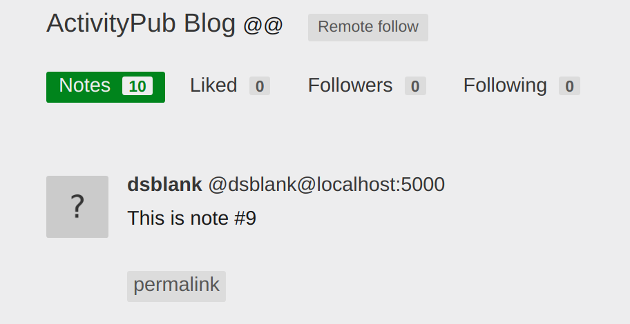

# ActivityPub Blog

This folder is based on:

* https://github.com/tsileo/microblog.pub
* https://github.com/tsileo/little-boxes

Goals:

* database independent (can use redis, sql, mongo, etc)
* web framework independent (can use flask or tornado)
* develop a multi-user blog with users
* complete support of ActivityPub

Work in progress!



To run, see [installation](../../README.md) and then:

1. Edit app.py for your own database/framework combination.

2. Run:

```
python3 app.py
```
